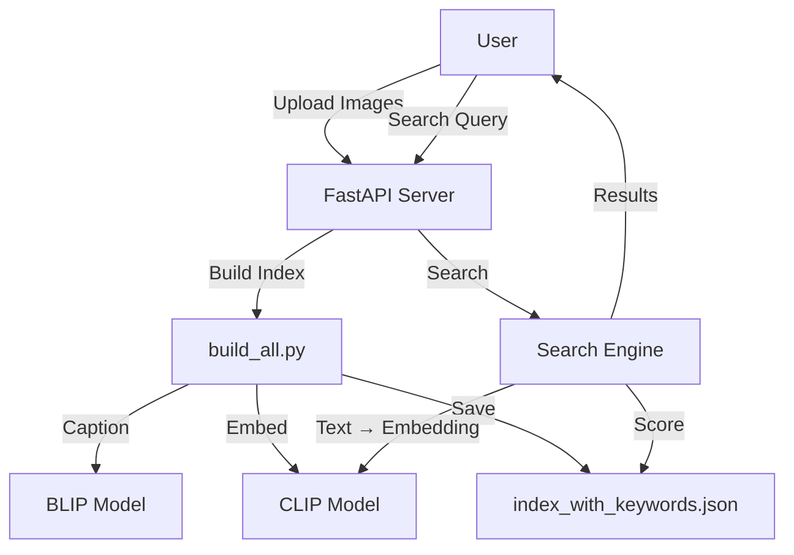
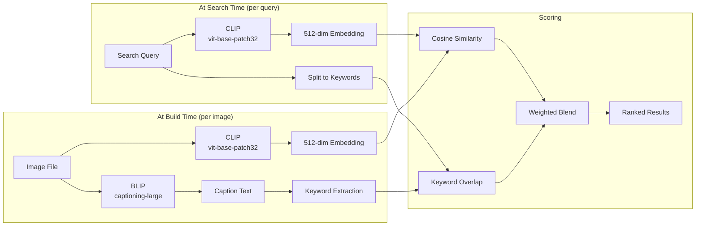

# GetIt — Project Flow & Architecture

> A detailed breakdown of how each component works, when each AI model is invoked, and how data flows through the system.

---

## High-Level Architecture



---

## 1. Server Startup

**File:** [`api.py`](file:///e:/Projects/Getit/app/api.py)

```
Server Start (uvicorn)
  ├─ Import models.py → triggers model loading
  │    ├─ Load BLIP processor + model → GPU/CPU
  │    └─ Load CLIP processor + model → GPU/CPU
  ├─ Create FastAPI app
  ├─ @startup_event → load_index()
  │    └─ Read data/index_with_keywords.json → memory (index_data[])
  └─ Mount frontend/ as static files
```

### Models Loaded at Startup

| Model | Identifier | Purpose | Loaded In |
|-------|-----------|---------|-----------|
| **BLIP** | `Salesforce/blip-image-captioning-large` | Generate captions from images | `models.py` line 62 |
| **CLIP** | `openai/clip-vit-base-patch32` | Generate embeddings for images & text | `models.py` line 66 |

Both models are loaded **once** at module import and cached for the server lifetime. They try local cache first (`models/blip/`, `models/clip/`), falling back to HuggingFace Hub download.

---

## 2. Image Upload Flow

**Endpoint:** `POST /api/upload`  
**File:** [`api.py`](file:///e:/Projects/Getit/app/api.py#L229-L264)

```
User selects images in frontend
  ├─ Files sent as multipart/form-data
  ├─ Server validates content_type starts with "image/"
  ├─ PIL opens and converts to RGB
  ├─ Saves to data/images/{filename}
  └─ Returns count of saved files
```

> [!IMPORTANT]  
> Upload does **NOT** process images (no AI models are invoked). The user must click **"Build Index"** separately to trigger processing. This prevents timeouts on large batches.

---

## 3. Build Index Flow (The Core Pipeline)

**Endpoint:** `POST /api/build` → runs `build_all()` in a background task  
**File:** [`build_all.py`](file:///e:/Projects/Getit/app/build_all.py#L162-L287)

This is where **both AI models** are actively used. For each unprocessed image:

```
build_all(force_reprocess=False)
  │
  ├─ 1. Scan data/images/ for image files
  │     (jpg, jpeg, png, webp, bmp, gif)
  │
  ├─ 2. Load existing index_with_keywords.json
  │
  ├─ 3. Cleanup: remove entries for deleted images
  │
  ├─ 4. Filter: skip already processed images
  │     (has processed=True + valid embedding + caption)
  │
  └─ 5. For each NEW image:
       │
       ├─ a. Open image → PIL RGB
       │
       ├─ b. Create thumbnail (300×300, JPEG, 85% quality)
       │     └─ Saved to data/thumbnails/{filename}
       │
       ├─ c. 🧠 BLIP: Generate Caption
       │     ├─ Input: PIL Image
       │     ├─ BlipProcessor tokenizes image
       │     ├─ BlipForConditionalGeneration.generate()
       │     │   ├─ max_new_tokens: 60
       │     │   └─ num_beams: 4 (beam search)
       │     └─ Output: "a dog sitting on a couch in a living room"
       │
       ├─ d. 🧠 CLIP: Generate Image Embedding
       │     ├─ Input: PIL Image
       │     ├─ CLIPProcessor preprocesses image
       │     ├─ CLIPModel.get_image_features()
       │     ├─ F.normalize() → unit vector
       │     └─ Output: 512-dim float32 vector
       │
       ├─ e. Extract Keywords from caption
       │     ├─ Lowercase + remove special chars
       │     ├─ Split into words
       │     ├─ Remove stopwords (a, the, is, are, etc.)
       │     ├─ Remove words ≤ 2 chars
       │     └─ Output: ["dog", "sitting", "couch", "living", "room"]
       │
       ├─ f. Extract Metadata
       │     └─ width, height, format, mode, size_bytes, modified
       │
       └─ g. Save entry to index:
             {
               filename, caption, embedding[512],
               keywords[], metadata{}, processed: true,
               processed_at: ISO timestamp
             }
```

### Index Output Files

| File | Contents | Usage |
|------|----------|-------|
| `data/index.json` | Basic entries (no keywords) | Backward compat |
| `data/index_with_keywords.json` | Full entries with keywords | Primary index |

---

## 4. Search Flow (The Query Pipeline)

**Endpoint:** `GET /api/search?query=...&top_k=10&clip_weight=0.8&keyword_weight=0.2`  
**File:** [`api.py`](file:///e:/Projects/Getit/app/api.py#L176-L226)

```
User types: "a cat sleeping on a bed"
  │
  ├─ 1. 🧠 CLIP: Generate Text Embedding
  │     ├─ Input: query string
  │     ├─ CLIPProcessor tokenizes text
  │     ├─ CLIPModel.get_text_features()
  │     ├─ F.normalize() → unit vector
  │     ├─ @lru_cache(128) — cached for repeat queries
  │     └─ Output: 512-dim float32 vector
  │
  ├─ 2. Extract query keywords
  │     └─ "a cat sleeping on a bed" → {"cat", "sleeping", "bed"}
  │
  ├─ 3. Score every image in index:
  │     │
  │     ├─ CLIP Score (cosine similarity)
  │     │   └─ dot(query_embedding, image_embedding)
  │     │       Both are pre-normalized, so dot = cosine sim
  │     │
  │     ├─ Keyword Score (set overlap)
  │     │   └─ |query_keywords ∩ image_keywords| / |query_keywords|
  │     │
  │     └─ Final Score (weighted blend)
  │         └─ 0.8 × clip_score + 0.2 × keyword_score
  │
  ├─ 4. Filter by min_score threshold
  │
  ├─ 5. Sort by final_score (descending)
  │
  ├─ 6. Return top_k results
  │
  └─ 7. Log to search_history[] (last 100 queries)
```

### Why Hybrid Scoring?

| Component | Strength | Weakness |
|-----------|----------|----------|
| **CLIP** (0.8 weight) | Understands visual semantics, matches concepts even without exact words | Can miss literal keyword matches |
| **Keywords** (0.2 weight) | Exact word matching for precision | Doesn't understand synonyms or visual context |

> The blend gives CLIP the dominant role in understanding *meaning*, while keywords boost results that happen to contain exact query terms.

---

## 5. Image Serving

**Endpoint:** `GET /api/image/{filename}?thumbnail=true|false`  
**File:** [`api.py`](file:///e:/Projects/Getit/app/api.py#L286-L305)

```
Frontend requests image
  ├─ thumbnail=true  → serve from data/thumbnails/ (300×300 JPEG)
  ├─ thumbnail=false → serve from data/images/ (original)
  └─ Fallback: if thumbnail missing, serve original
```

Thumbnails are used in the search results grid for fast loading. Full images are served in the detail modal.

---

## 6. Other Endpoints

| Endpoint | Method | Purpose |
|----------|--------|---------|
| `/api/stats` | GET | Total images, keywords count, unique keywords, model info |
| `/api/history` | GET | Last 20 search queries |
| `/api/reload` | POST | Reload index from disk into memory |
| `/` | GET | Serve `frontend/index.html` |

---

## Model Summary



| Model | Used During | Function Called | Input | Output |
|-------|------------|----------------|-------|--------|
| **BLIP** (`Salesforce/blip-image-captioning-large`) | Build Index | `generate_caption(image)` | PIL Image | Caption string |
| **CLIP** (`openai/clip-vit-base-patch32`) | Build Index | `get_image_embedding(image)` | PIL Image | 512-dim vector |
| **CLIP** (`openai/clip-vit-base-patch32`) | Search | `get_text_embedding(text)` | Query string | 512-dim vector |

> [!NOTE]
> BLIP is **only** used at build time. CLIP is used at **both** build time (image embeddings) and search time (text embeddings). This means searches are fast — only one CLIP inference per query, then pure math (dot products) against pre-computed embeddings.

---

## File Structure

```
GetIt/
├── app/
│   ├── api.py            # FastAPI server, endpoints, search scoring
│   ├── models.py          # Model loading, BLIP/CLIP inference functions
│   ├── build_all.py       # Indexing pipeline with incremental processing
│   └── process_image.py   # Simple wrapper (caption + embed)
├── data/
│   ├── images/            # Source images
│   ├── thumbnails/        # 300×300 JPEG thumbnails
│   ├── index.json         # Basic index (backward compat)
│   └── index_with_keywords.json  # Full index with keywords
├── models/
│   ├── blip/              # Cached BLIP model weights
│   └── clip/              # Cached CLIP model weights
├── frontend/
│   └── index.html         # Single-page UI
└── requirements.txt
```
