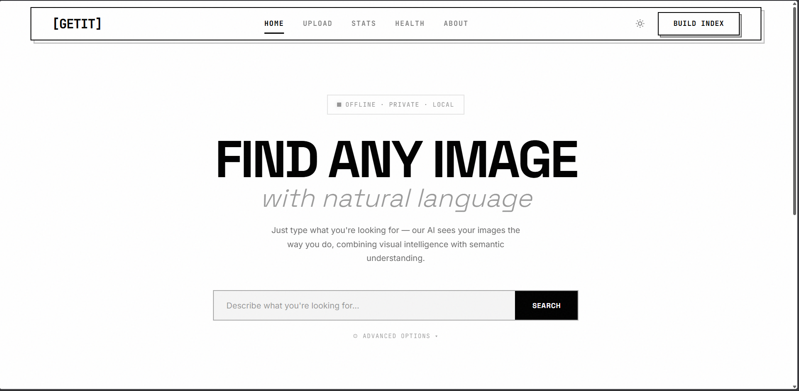

# 🧠 GetIt — Local Multimodal Semantic Search Engine

A **privacy-first, offline-capable Semantic Image Search Engine** for your local image library.  
Search images using **natural language** powered by **Hybrid AI** — combining visual understanding (CLIP) and semantic captions (BLIP).

---

## ✨ Highlights

- 🔒 **100% Local & Offline** — No cloud, no API keys
- 🧠 **Hybrid AI Search** — Visual + Semantic understanding
- ⚡ **Fast Web UI** — FastAPI + Vanilla JS
- 📸 **Auto Indexing** — Captions & embeddings generated locally

---

## 🚀 Features

### 🧠 AI Engine
- **CLIP (Visual Embeddings)**  
  Finds images based on visual similarity  
  _Example:_ `dog running on grass`

- **BLIP (Semantic Captions)**  
  Generates descriptive captions to capture hidden context

- **Keyword Cleaning**  
  Removes noise for accurate semantic matching

---

### 💻 Web Interface
- 🎨 Minimal UI (Dark/Light ready, Space Grotesk)
- 📤 Multi-image upload (Drag & Drop)
- ⚡ One-click indexing from Navbar
- 🎚 Adjustable search weights (CLIP vs Keywords)
- 📊 System stats & latency monitoring

---
## 📸 Screenshots
Homepage


---

## 🛠 Tech Stack

**Backend**
- Python 3.9+
- FastAPI
- Uvicorn

**AI Models**
- OpenAI CLIP — Image embeddings
- Salesforce BLIP — Image captioning

**Frontend**
- HTML5
- CSS3 (Variables)
- Vanilla JavaScript

**Storage**
- JSON-based index (Portable & simple)

---

## ⚙️ Installation

### 1️⃣ Clone & Setup
```bash
git clone https://github.com/yourusername/image-search-ai.git
cd image-search-ai

python -m venv venv

# macOS / Linux
source venv/bin/activate

# Windows
venv\Scripts\activate

pip install -r requirements.txt
````

---

## 🏃 Usage

### Start Server

```bash
python app/api.py

# OR
uvicorn app.api:app --host 0.0.0.0 --port 8000 --reload
```

### Open Web UI

```
http://localhost:8000
```

---

### 🔄 Workflow

1. **Upload Images**
   Upload JPG / PNG / WEBP from browser

2. **Build Index**
   Click **⚡ Build Index** (first run downloads ~1GB models)

3. **Search**
   Use natural language
   *Examples:*

   * `cat on sofa`
   * `sunset at beach`

4. **Explore**
   View CLIP score, keyword score & metadata

---

## 📡 API Reference

| Method | Endpoint            | Description                                     |
| ------ | ------------------- | ----------------------------------------------- |
| GET    | `/api/search`       | Search images (`query`, `top_k`, `clip_weight`) |
| POST   | `/api/upload`       | Upload images                                   |
| POST   | `/api/build`        | Trigger re-indexing                             |
| GET    | `/api/stats`        | Dataset & system stats                          |
| GET    | `/api/image/{name}` | Serve image file                                |

---

## 📂 Project Structure

```
image-search-ai/
│
├── app/                    # Application source code
│   ├── api.py              # FastAPI backend
│   ├── build_all.py        # Indexing logic
│   └── models.py           # Model loader (singleton)
│
├── frontend/
│   └── index.html          # Web UI
│
├── data/
│   ├── images/             # Uploaded images
│   ├── thumbnails/         # Generated thumbnails
│   └── index_with_keywords.json
│
└── requirements.txt
```

---
## ⚠️ Limitations

- Initial indexing can be slow on low-end CPUs
- JSON index not ideal for very large datasets (10k+ images)
- No GPU acceleration by default

---
## 🧪 Tested On

- macOS (M4 / Intel)
- Ubuntu 22.04
- Windows 11 (CPU-only)

---
## 🔐 Privacy

- No network calls after model download
- Images never leave your system
- No telemetry or analytics
---

## 🧩 Configuration

You can tweak search behavior in `api.py`:

- `TOP_K_RESULTS`
- `DEFAULT_CLIP_WEIGHT`
- `THUMBNAIL_SIZE`

---
## 🧠 Why Hybrid Search?

CLIP excels at visual similarity  
BLIP captures semantic meaning  

Combining both improves accuracy for ambiguous or abstract queries.


---

## 🔮 Roadmap

* 🔹 Vector DB (FAISS / ChromaDB)
* 🔹 OCR Support (Tesseract)
* 🔹 Mobile PWA support
* 🔹 Object detection with bounding boxes

---

## 🙌 Credits

* Built with **FastAPI**
* Powered by **HuggingFace Transformers**
* Prafull Harer

---

⭐ **Star this repository if you find it useful!**

```
